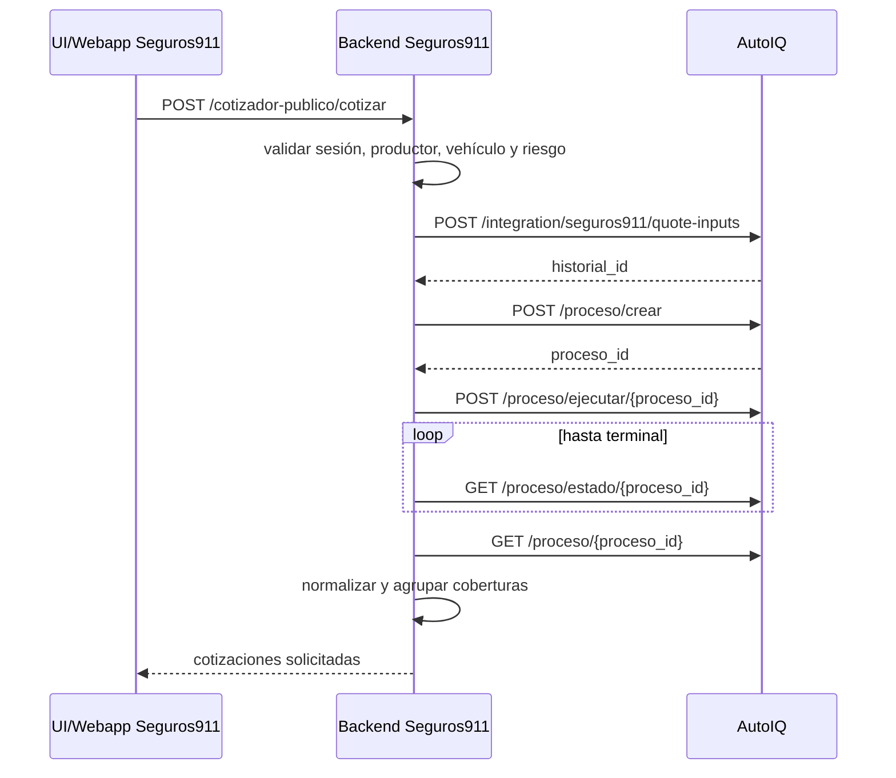

# Cómo pedir una cotización individual desde Seguros911

Este es el contrato operativo principal. Explica qué debe hacer la Webapp o UI de Seguros911, qué debe hacer exclusivamente su backend y cómo ese backend debe manejar el proceso completo de AutoIQ.

## Regla de arquitectura

La UI/Webapp **nunca llama directamente a AutoIQ** ni conoce el secreto HMAC. La UI llama al backend Seguros911; el backend valida, normaliza, firma y llama a AutoIQ.



## 1. Lo que envía la UI/Webapp a Seguros911

Endpoint observado: `POST /cotizador-publico/cotizar` (el prefijo exacto depende del montaje del router de Seguros911).

```json
{
  "sessionUuid": "11111111-2222-4333-8444-555555555555",
  "webappId": "seguros911-publico",
  "producto": "auto",
  "marcaCodigo": "21",
  "anio": 2024,
  "esCeroKm": false,
  "modelo": "CRONOS",
  "codigoInfoAuto": "170890",
  "codigoPostal": "1425",
  "localidad": "PALERMO",
  "provincia": "CABA",
  "edad": 40,
  "genero": "masculino",
  "estadoCivil": "soltero",
  "uso": "particular",
  "gnc": true,
  "gncMonto": 800000,
  "rastreo": "0",
  "rastreo_sistema": "sin_rastreo"
}
```

La UI debe enviar booleanos JSON reales para `gnc` y `esCeroKm`, no strings `"false"`/`"true"`. Debe conservar el código de la versión seleccionada; `marcaCodigo` o el texto del modelo no reemplazan a `codigoInfoAuto`.

### Campos actuales de Seguros911

| Campo | Obligatorio | Semántica |
|---|---:|---|
| `sessionUuid` | sí | sesión existente de Webapp/UI |
| `webappId` | no | determina productor y compañías habilitadas |
| `producto` | sí | hoy `auto`; debe actuar como discriminador para futuras motos |
| `marcaCodigo` | sí | código del catálogo mostrado por Seguros911 |
| `anio` | sí | 1990 hasta año actual + 1 |
| `esCeroKm` | no | condición real del vehículo |
| `modelo` | sí | modelo/familia visible |
| `codigoInfoAuto` | sí | versión exacta; `versionCode` es alias de entrada existente |
| `codigoPostal` | sí | 4 a 8 dígitos; AutoIQ hoy usa los primeros 4 para automotor |
| `localidad`, `provincia` | recomendados | validación y traducción territorial |
| `edad`, `genero` | sí | datos tarifarios del conductor/asegurado |
| `estadoCivil` | no | dato tarifario cuando la compañía lo utiliza |
| `uso` | no | `particular` o `comercial`; default actual particular |
| `gnc` | no | presencia real de GNC |
| `gncMonto` | condicional | monto ARS positivo cuando `gnc=true` |
| `rastreo` | no | `"0"` o `"1"` |
| `rastreo_sistema` | no | sistema normalizado admitido por el schema |

Antes de habilitar otro producto, como motos, no alcanza con cambiar `producto`: Seguros911 debe seleccionar catálogo/tipo correcto y AutoIQ debe declarar aseguradoras ejecutables y mapeos para ese producto.

## 2. Validaciones que pertenecen al backend Seguros911

El backend debe rechazar la solicitud antes de llamar AutoIQ cuando:

- no existe la sesión;
- falta la versión/código InfoAuto;
- localidad y CP no corresponden al catálogo seleccionado;
- `gnc=true` sin monto positivo;
- `gnc=false` con monto positivo;
- falta un dato requerido para el tipo de vehículo/producto;
- el productor o la Webapp no tienen compañías habilitadas.

La UI puede anticipar esos errores, pero la validación definitiva debe quedar en backend.

## 3. Construcción de la fila enviada a AutoIQ

Seguros911 debe enviar una sola fila a `POST /integration/seguros911/quote-inputs`:

```json
{
  "producer_public_uuid": "productor-public-uuid",
  "row": {
    "anio": 2024,
    "marca": "FIAT",
    "modelo": "CRONOS 1.3 DRIVE",
    "codigo_infoauto": "170890",
    "suma": 15000000,
    "cerokm": 0,
    "uso": "Particular",
    "tipo_uso": "1",
    "tipo_vehiculo": "AUTO",
    "provincia": "CABA",
    "localidad": "PALERMO",
    "CP": "1425",
    "rastreo": 0,
    "rastreo_sistema": "sin_rastreo",
    "gnc": 1,
    "suma_gnc": 800000
  }
}
```

Campos esenciales de la fila: identidad exacta del vehículo (`anio`, `marca`, `modelo`, `codigo_infoauto`), valor (`suma`), clase (`tipo_vehiculo`), ubicación, uso y características del riesgo. AutoIQ puede conservar aliases históricos internamente, pero Seguros911 debe producir un único nombre objetivo por concepto.

Respuesta:

```json
{"historial_id":123,"file_name":"cotizador-publico-...xlsx"}
```

`historial_id` debe persistirse en Seguros911 para trazabilidad.

## 4. Cabecera específica de esta cotización

Luego el backend llama `POST /proceso/crear`:

```json
{
  "historial_id": 123,
  "cabecera_id": 16,
  "nombre": "Seguros911 publico - auto - FIAT - CRONOS - 1425",
  "aseguradoras": ["allianz", "atm", "experta", "mapfre"],
  "commercial_context": "seguros911",
  "commercial_user_id": "productor-public-uuid",
  "cabecera_override": {
    "sexo": "M",
    "fec_nac": "1986-01-01",
    "est_civil": "soltero",
    "cerokm": "0",
    "tipo_uso": "1",
    "uso_default": "1",
    "rastreo": "0",
    "rastreo_sistema": "sin_rastreo",
    "gnc": "1",
    "suma_gnc": "800000",
    "medio_pago": "TC"
  }
}
```

La fila describe el vehículo/riesgo; `cabecera_override` fija los parámetros tarifarios de esta cotización individual. Deben ser coherentes. Para Seguros911, el override explícito de esta solicitud prevalece sobre la cabecera base y sobre cualquier default comercial. Las condiciones comerciales del productor aportan descuentos, planes y traducciones; no deben cambiar los hechos del riesgo.

Respuesta relevante: `proceso_id` y `metadata`. Ambos IDs (`historial_id`, `proceso_id`) deben quedar asociados a la sesión/cotización/oportunidad en Seguros911.

## 5. Ejecución

Llamar una sola vez:

```http
POST /proceso/ejecutar/456
Content-Type: application/json

{}
```

No crear un proceso por compañía. Una solicitud individual puede pedir varias aseguradoras en `aseguradoras`; AutoIQ se ocupa de adaptar el mismo riesgo para cada una.

## 6. Polling

Consultar `GET /proceso/estado/456`. Mientras el estado sea `creado`, `en curso`, `pendiente`, `pendiente de reintento` o existan tareas pendientes, continuar con polling y backoff. Finalizar polling ante `completado`, `con errores`, `incompleto` o bloqueo operativo.

Seguros911 no debe interpretar `HTTP 200` como “todas las compañías cotizaron”: debe leer estado, contadores y resultados parciales.

## 7. Resultado

Al terminar, consultar `GET /proceso/456`. El resultado se organiza por aseguradora. Seguros911 debe publicar sólo filas con `ok=true`, `coberturas` válidas y premio utilizable; debe conservar por separado errores y compañías sin oferta.

Por cobertura debe conservar como mínimo:

- aseguradora;
- operación/cotización externa;
- código y descripción de producto/cobertura;
- grupo visual normalizado;
- premio mensual y, si corresponde, anual;
- suma asegurada informada;
- cuotas/período;
- franquicia;
- indicadores y detalles de cobertura.

No debe devolver `raw` del proveedor a la UI. Un timeout, un rechazo comercial y una respuesta exitosa sin coberturas son resultados distintos.

## 8. Responsabilidad de cada capa

| Capa | Responsabilidad |
|---|---|
| UI/Webapp | capturar datos sin perder códigos de catálogo; mostrar validaciones y estado |
| backend Seguros911 | validar, resolver productor/Webapp, construir fila+override, firmar, persistir IDs, hacer polling y presentar opciones |
| AutoIQ | traducir el riesgo por compañía, aplicar condiciones, ejecutar, reintentar cuando corresponda y normalizar resultados |
| condiciones comerciales | valores comerciales/mapeos; nunca reemplazar hechos del riesgo |

## 9. Cómo extender mañana

Para agregar uso comercial, Seguros911 ya debe enviar `uso="comercial"`, y mapear `tipo_uso="2"` tanto en fila como en override. Deben agregarse tests que prueben que todas las aseguradoras reciben el código correcto.

Para agregar motos u otro producto:

1. ampliar el enum/schema de `producto` en Seguros911;
2. incorporar catálogo e identificador de versión adecuados;
3. definir el schema de fila específico sin reutilizar semánticas de auto incorrectamente;
4. declarar aseguradoras disponibles para ese producto;
5. implementar/verificar adaptadores AutoIQ;
6. mantener el mismo ciclo `quote-inputs → crear → ejecutar → estado → resultado`;
7. agregar ejemplos y tests contractuales antes de habilitar la UI.

Así el servicio evoluciona agregando capacidades al riesgo y a los adaptadores, sin rediseñar la orquestación completa.

