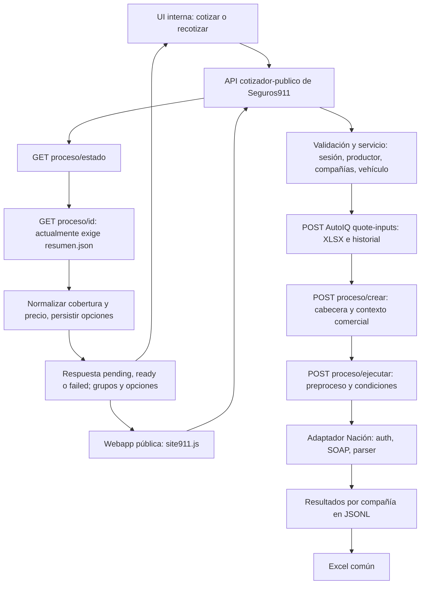

# Auditoría del circuito Seguros911 → AutoIQ → Nación → Seguros911

Fecha: 2026-09-09. Complementa la [comparación documental](D:/AutoIQ/docs/nacion-comparacion-documental-2026-09-09.md).

**Conclusión:** la arquitectura permite incorporar Nación, pero el circuito actual no está listo para devolver sus ofertas correctamente. Hay problemas comunes anteriores al adaptador, un corte en la recuperación de resultados y reglas económicas de Seguros911 que deben alinearse. No alcanza con habilitar Nación y reemplazar su SOAP.

## Alcance y evidencia

Se revisó el código local de `D:/AutoIQ` y del checkout `D:/Seguros911-integracion-autoiq`. Esto identifica el comportamiento de esos archivos; no verifica que sean las versiones desplegadas ni el estado de sus bases de datos. No se hicieron cotizaciones reales, llamadas a proveedores, cambios en programas o activaciones. Se agregan este informe, un script aislado y evidencia sintética.

Las pruebas utilizan funciones reales con red, archivos de configuración y DB sustituidos cuando corresponde. [Resultados reproducidos](D:/AutoIQ/docs/contracts/nacion/circuit-audit-2026-09-09.json), [script](D:/AutoIQ/tmp/nacion-circuit-audit.cjs). Se ejecutaron también 42 pruebas existentes de `seguros911_contract`, `service_auth` y `seguros911_product_catalog`: todas pasan. No son pruebas integrales entre ambos servidores y no cubren los hallazgos siguientes.

## Recorrido real

| Etapa | Programas revisados y contrato efectivo | Evaluación para Nación |
|---|---|---|
| Entrada | `recursos/Maquetado/js/site911.js`; `backend/public/app.js`; `/api/cotizador-publico/cotizar` y `/oportunidades/:id/recotizar` | UI y Webapp tienen capacidades distintas; ver riesgo abajo. |
| Validación | `cotizador-publico.schemas.js`, routes y controller | Diferencia entre cotización inicial y recotización; coerción booleana peligrosa. |
| Preparación | `cotizador-publico.service.js:3839`, `cotizador-publico.autoiq.js:649` | Resuelve catálogo, productor de la Webapp y compañías; forma fila con aliases y cabecera override. |
| Transporte | `integrations/autoiq/client.js`, `backend/middleware/service_auth.js` de AutoIQ | HMAC en rutas privadas; el ciclo `/proceso` no tiene el mismo control en el servidor inspeccionado. |
| Persistencia inicial | AutoIQ `seguros911_integration.js:44`, `proceso.js:6041` | XLSX de una fila, historial y metadata del proceso; sin validación semántica completa de riesgo. |
| Cabecera y perfil | `proceso.js:6257`, `preprocesado_helper.js`, `commercial_conditions/index.js:898`, `proceso.js:3456` | Conserva override en metadata, pero uso puede ser reemplazado por perfil. |
| WS | `proceso.js:4635`, `services/nacion/auth.js`, `quote.js`, `transport.js` | Autenticación inicial trabajada; constructor/parser y transporte SOAP aún son borradores. |
| Consolidación | `proceso.js:5585`, `:5660`, `:5960`, `generarExcelProceso` | JSONL y Excel disponen de infraestructura común. El GET usado por Seguros911 no reconstruye JSONL. |
| Publicación | `seguros911_product_catalog.js:1493`, `cotizador-publico.autoiq.js:1351`, `cotizador-publico.service.js:2057` | Requiere identidad/grupo, importe mensual y alta de compañía en DB. |
| Seguimiento | `cotizador-publico.service.js:2566`, `:3595`, `:3755`; `site911.js:880` | Ejecución en segundo plano y consultas sucesivas; distingue ofertas publicables, pero necesita resultado recuperable. |

El cliente `integrations/autoiq/cotizaciones.js` también contiene `/cotizacion/iniciar`. Es otro recorrido, anterior: la cotización pública examinada usa `quote-inputs` y `/proceso/*`. No hay que integrar Nación suponiendo que ambos contratos son intercambiables.

## Hallazgos prioritarios

### 1. La devolución puede fallar aunque la cotización termine

**Bloqueo común comprobado por lectura del flujo.** [AutoIQ activa siempre JSONL](D:/AutoIQ/backend/routes/proceso.js:5585); cada resultado se agrega al archivo de su compañía y el cierre escribe `resumen.csv`, no `resumen.json`. El [GET que consume Seguros911](D:/AutoIQ/backend/routes/proceso.js:6638) exige que exista `resumen.json`: si falta, devuelve 404, aunque exista metadata y JSONL. Si queda un resumen de una corrida anterior, puede devolver información vieja. `/estado` sí devuelve metadata, pero su resumen también depende de ese archivo.

Existe `buildResumenFromJsonlMetadata`, pero no está conectado a ese GET. El Excel sí tiene lectura de JSONL: por eso verificar sólo un Excel exitoso no valida la devolución por API. La respuesta de ejecutar contiene `resultados:{}` con referencia al almacenamiento incremental y tampoco resuelve por sí sola este corte.

**Corrección necesaria:** conservar el shape actual de la API y construir el resumen desde el almacenamiento vigente; distinguir proceso inexistente, pendiente y terminado. Probar un proceso nuevo sin `resumen.json` y otro con resumen anterior más JSONL actualizado.

### 2. El uso declarado puede ser reemplazado por el perfil comercial

**Reproducido.** Seguros911 envía `uso=Comercial`, `tipo_uso=2` y un override equivalente. Sin embargo, en contexto Seguros911 el [resolvedor comercial](D:/AutoIQ/backend/services/commercial_conditions/index.js:917) no toma la cabecera como fuente. Luego [el puente](D:/AutoIQ/backend/routes/proceso.js:3519) escribe `values.uso` sobre cabecera y `mapeos.uso_codigo`.

Con perfil Particular/1 y riesgo Comercial/2, la función real devuelve código **1**. No depende de tener Nación activa; el borrador Nación prioriza precisamente `mapeos.uso_codigo`. La prueba demuestra el mecanismo cuando existe un valor de perfil aplicable, no que hoy haya un perfil Nación cargado en la tienda real.

**Corrección necesaria:** los hechos del riesgo prevalecen; el perfil sólo traduce su código o expresa restricciones. Si un uso no está admitido, informar incompatibilidad. No convertirlo silenciosamente en particular.

### 3. GNC y 0 km: el transporte existe, pero la validación y los frentes difieren

**Reproducido:** `quoteSchema` acepta `gnc=true` sin monto; `opportunityRecotizeSchema` lo rechaza. Además `z.coerce.boolean()` interpreta las cadenas `"false"` y `"0"` como verdaderas. En la prueba, GNC y 0 km terminan ambos en `true`. Con booleanos JSON reales `false` este problema no ocurre.

El [armador de la fila](D:/Seguros911-integracion-autoiq/backend/src/modules/cotizador-publico/cotizador-publico.autoiq.js:649) conserva GNC/monto y 0 km. AutoIQ conserva el override de 0 km; `mergeCabecera` limpia el monto cuando GNC pasa a cero. Esto sí sirve como base. Sin embargo, la advertencia `GNC_WITHOUT_AMOUNT` no sustituye rechazar un riesgo inválido antes del WS, y el esquema Seguros911 admite sólo monto entero mientras Nación describe dos decimales.

Hay que distinguir origen:

- La **UI interna** arma GNC/monto/uso y valida el monto en cotización y recotización. Al quitar GNC limpia el monto.
- La **Webapp pública revisada**, [site911.js](D:/Seguros911-integracion-autoiq/recursos/Maquetado/js/site911.js:687), envía 0 km, pero no GNC, monto ni uso. El armador backend convierte esas omisiones en sin GNC/particular. Su fingerprint de frontend tampoco contempla esos campos.

**Corrección necesaria:** definir captura o restricción explícita en la Webapp, validar igual desde cualquier cliente, usar booleanos estrictos o conversión explícita y cubrir cambios de ida y vuelta. Admitir un campo en la API no implica que el usuario pueda declararlo en todos los frentes.

### 4. Tipo de vehículo y uso profesional no tienen una validación suficiente

Seguros911 resuelve tipo con un conjunto de etiquetas y heurísticas; lo desconocido puede terminar en Sedán. El preprocesador común tiene una identificación específica de motos sólo para ATM. Nación no tiene un diccionario local de tipos y el request actual no establece elegibilidad por clase.

El schema admite `producto=moto`, pero el código de selección de compañías no contiene una matriz Nación por tipo/uso. En el diccionario Nación actual figuran 3, 4, 12 y 16 además de 1 y 2; su existencia local no prueba que el cotizador vigente los admita. El contrato revisado documenta particular/comercial. La API pública admite esos dos nombres; `profesional` no es un tercer valor aceptado.

**Corrección necesaria:** identificar el tipo por catálogo fiable, definir los usos profesionales concretos y su elegibilidad por compañía, y rechazar lo no confirmado. No homologar taxi/remís/oficial con comercial sin respaldo del proveedor.

### 5. Faltan productor Nación y datos individuales del tomador

El servicio toma el productor desde la configuración de la Webapp, lo pasa a `quote-inputs` y como `commercial_user_id` al proceso. Hay trazabilidad interna, pero no conversión de ese UUID a un código productor autorizado de Nación por ambiente/cotizador.

`DEFAULT_CABECERA_ID=16` sigue fijo. El override permitido no incluye nombre/email, y `quoteSchema` tampoco incluye contacto del tomador. Incluso agregar esos campos arbitrariamente al JSON no los incorpora al recorrido validado. Hace falta una fuente por solicitud o modalidad anónima confirmada por Nación; no reutilizar contacto de una cabecera compartida.

**Corrección necesaria:** cerrar ambos contratos antes de la primera cotización real. El código productor solicitado al proveedor resuelve el dato externo, pero no su asociación ni selección interna.

### 6. El borrador SOAP Nación aún no corresponde al contrato comprobado

El [constructor/parser](D:/AutoIQ/backend/services/nacion/quote.js) conserva nombres y estructura anteriores, no agrega token al XML ni GNC/0 km/productor/tomador como exige el contrato vigente. La rama en [proceso.js](D:/AutoIQ/backend/routes/proceso.js:4700) construye el sobre antes de obtener token y luego usa Bearer/User en headers. El request debe rehacerse contra el WSDL guardado, y el parser debe recorrer control, proceso, mensajes y lista real de coberturas.

El transporte SOAP usa Axios directamente y no reutiliza `nacionTransportOptions`: configurar sólo `NACION_CA_FILE` para auth no lo aplica a SOAP. Matiz respecto del informe anterior: `npm start` ya llama a `tools/start-autoiq.js`, que puede provisionar `NODE_EXTRA_CA_CERTS` globalmente si encuentra una CA. Hay que probar el arranque real y unificar el comportamiento, no afirmar que todo arranque carece de CA.

Las condiciones comerciales también deben ajustarse: pago, descuento, comisión y cuotas del perfil no son parámetros libres de este cotizador. No registrar una condición como efectivamente enviada si el request no la contiene.

### 7. Un importe correcto del proveedor puede convertirse en una oferta mensual incorrecta

**Reproducido.** [Seguros911 elige primero `importeCuota`](D:/Seguros911-integracion-autoiq/backend/src/modules/cotizador-publico/cotizador-publico.autoiq.js:1179), antes de `premiumMonthly`. El tratamiento de período sólo contempla Victoria; las otras compañías reciben un mes por defecto.

En una cobertura sintética Nación con cuota 1200, mensual explícito 1000 y total de tres meses 3000, produce:

| Campo publicado | Resultado actual |
|---|---:|
| monthlyPremium | 1200 |
| billingPeriodMonths | 1 |
| annualPremium | 3000 |

El ejemplo demuestra la precedencia y confusión de períodos; no es una cotización real de Nación. La [persistencia](D:/Seguros911-integracion-autoiq/backend/src/modules/cotizador-publico/cotizador-publico.service.js:2122) guarda ese importe como premio y vigencia mensual. Otros caminos reconstruyen anual como mensual × 12, por lo que también puede variar entre respuesta fresca y recuperada.

**Corrección necesaria:** definir un importe mensual explícito y respetado de punta a punta, conservar período, total y cuota separados, normalizar Nación según `FACTURACION_MESES` y evitar que una segunda heurística vuelva a transformar el resultado. Excel y JSON deben coincidir económicamente.

### 8. Cotización recibida no equivale a oferta publicable

`extractGroupedOptions`/`auditGroupedOptions` descartan resultados no exitosos, sin coberturas, sin grupo reconocible o sin importe positivo. La decoración visual depende de identidad de producto/cobertura y catálogo; Nación necesita códigos estables, agrupación y detalles revisados. Un parser que sólo devuelva precio no completa el trabajo.

Además, [persistAutoIqQuoteOptions](D:/Seguros911-integracion-autoiq/backend/src/modules/cotizador-publico/cotizador-publico.service.js:2112) omite una oferta si `findCompanyByCode` no encuentra el slug en la tabla `companias`. No se consultó esa DB: queda por verificar el alta `nacion`, logo y habilitación de cada Webapp/productor.

La disponibilidad también se cachea por firma del directorio de servicios, no por fecha de cada `aseguradora.json`; cambiar sólo `activo` puede no actualizar la lista hasta reinicio u otro cambio de firma. Si falla la lectura, la lista fallback incluye Nación. AutoIQ debe seguir siendo la autoridad de habilitación; no basar el alta en ese fallback.

### 9. Firma, autorización y reintentos requieren cierre en todo el recorrido

En el [servidor AutoIQ inspeccionado](D:/AutoIQ/backend/server.js:435), HMAC se valida dentro del router privado `/integration/seguros911`, pero `/proceso/*` usa contexto de la sesión local de AutoIQ. El cliente Seguros911 firma esas llamadas, pero eso no implica que el receptor verifique la firma o construya el contexto del productor. El comportamiento de permisos puede depender del usuario seleccionado en AutoIQ. No se afirma aquí exposición pública del servidor: no se inspeccionó su perímetro de red.

**Reproducido:** cliente firma el body literal `{}`, mientras `bodyDigest({})` calcula el hash de cadena vacía. Esto rompe la interoperabilidad cuando un POST vacío pasa por ese middleware. No es la causa actual de un rechazo de `/proceso/ejecutar`, porque ese router no lo aplica; sí es un obstáculo al completar la protección del ciclo. Las pruebas existentes usan el canonicalizador del servidor para generar la firma y no detectan esta diferencia con el cliente real.

Para Nación, un timeout se clasifica por el flujo común como técnico/reintentable; la cola puede repetirlo. Cotizar registra presupuesto y todavía no se probó idempotencia. Definir resultado incierto antes de permitir repetición automática. La reutilización por fingerprint de Seguros911 no deduplica operaciones dentro de Nación.

El fingerprint incluye GNC, monto, uso y 0 km en backend, pero no productor, configuración comercial ni conjunto de compañías. Cambiar condiciones/habilitaciones puede reutilizar una cotización de la misma sesión y mes si no se fuerza una nueva. Debe existir una política explícita de vigencia e invalidación comercial.

### 10. Error latente al preparar riesgos sin valuación

**Reproducido con dependencias simuladas:** [prepareRemoteQuote](D:/Seguros911-integracion-autoiq/backend/src/modules/cotizador-publico/cotizador-publico.autoiq.js:1582) evalúa `versionRow.valor || valuation`, pero `valuation` no está declarada en esa función. Con `valor=0` o ausente arroja `valuation is not defined` después de las llamadas de creación de input/proceso.

Eso puede dejar un proceso creado sin asociación persistida en Seguros911; repetir el pedido podría crear otro. No se demostró que hoy el catálogo normal permita llegar a ese caso, pero sí falla la función ante esa entrada. Es relevante si se contempla cotizar sin suma de referencia o incorporar otra fuente de valuaciones.

### 11. Tablas y evidencia requieren trabajo adicional

El gestor de catálogos tiene una entrada Nación para `uso`, pero [fetchFromProvider](D:/AutoIQ/backend/services/catalogos/index.js:1281) no tiene proveedor remoto Nación. El snapshot Seguros911 sigue tomando las cuatro tablas ATM. Agregar archivos o la compañía no implementa actualización remota de bancos/tarjetas ni difusión de nuevas tablas.

No se encontró evidencia adicional de un maestro Nación de valuaciones. Si aparece, debe conservar procedencia, fecha, código y unidad; no sobrescribir el maestro ATM con sumas aisladas de cotizaciones o pólizas.

El flujo común conserva `raw` completo en JSONL y evidencias; `compactResultForJsonl` actualmente devuelve el objeto sin sanitizar. El response Nación puede devolver token y datos del tomador. Al corregir la recuperación JSONL hay que evitar propagar esos campos al consumidor, además de sanear las evidencias internas conforme a la política existente. No basta con que la tarjeta visual no los muestre.

## Orden de cierre y prueba integral requerida

1. Reparar devolución JSONL y delimitar autenticación/contexto de todas las llamadas entre sistemas, manteniendo compatibilidad de rutas y respuesta.
2. Alinear validación de riesgo y precedencia frente a perfiles; completar captura de la Webapp donde corresponda.
3. Resolver productor/tomador y capacidades comerciales Nación.
4. Construir request y parser contra WSDL, con transporte consistente y tratamiento de errores funcionales/técnicos/inciertos.
5. Definir economía mensual compartida, identidad de coberturas y publicación en Seguros911; verificar compañía y habilitaciones en DB.
6. Conectar sólo las tablas reales necesarias y su actualización.
7. Ejecutar una prueba integral por API con una fila, recuperando resultados de un proceso nuevo y verificando JSON, opción persistida, tarjeta y Excel.

| Casos mínimos | Resultado que debe comprobarse |
|---|---|
| GNC no→sí con monto→no | El XML cambia; al quitar GNC no queda monto heredado. |
| GNC sin monto, monto inválido, strings booleanos | Rechazo consistente antes de crear trabajo remoto. |
| Usado↔0 km | La marca explícita prevalece; no inferir sólo del año. |
| Particular↔comercial con perfil opuesto | Se conserva el riesgo o se informa incompatibilidad. |
| Auto/pickup/van/moto/uso profesional | Elegibilidad confirmada, sin fallback silencioso a automóvil particular. |
| Dos productores y dos tomadores simultáneos | Códigos/contactos correctos sin contaminar cabecera compartida. |
| Pago/condiciones solicitadas no admitidas | Mostrar condición efectiva o incompatibilidad; no simular descuentos. |
| Una/múltiples coberturas y período de varios meses | Importes comparables en API, DB, tarjeta y Excel. |
| Éxito parcial, rechazo funcional, timeout incierto | Sin ofertas ficticias ni repetición ciega del presupuesto. |
| Sólo JSONL y resumen antiguo | API devuelve resultado vigente y mismo contrato. |
| Cambio de condiciones/compañías y reconsulta | No reutilizar una oferta bajo condiciones que ya no corresponden. |

Se puede avanzar con piezas aisladas de Nación, pero **no habilitar publicación real** hasta cerrar estas dependencias y probar el recorrido completo. Los 42 tests actuales y el login exitoso no acreditan ese cierre.
